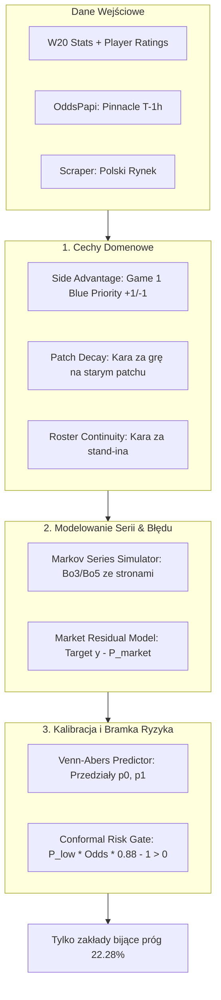

# EXP-040: Nowa Architektura Modelowa i Przewodnik Operacyjny

Dokumentacja techniczna i operacyjna systemu predykcji oraz selekcji wartościowych zakładów w League of Legends w warunkach polskiego podatku obrotowego (12%).

---

## 1. Streszczenie i Diagnoza Problemu

### Dlaczego stary model (EXP-039) przynosił straty pod polskim podatkiem?
W polskim reżimie prawnym każdy zakład obciążony jest **12% podatkiem obrotowym od stawki**, a legalni bukmacherzy pobierają średnio **8.64% marży (overround)**.
Aby zakład był matematycznie opłacalny ($EV > 0$), rzeczywiste prawdopodobieństwo wygranej musi pokonać tzw. **Hurdle Rate**:
$$\text{Wymagany narzut podatkowy} = \frac{1}{1 - 0.12} - 1 = \frac{1}{0.88} - 1 = \mathbf{+13.64\%}$$
$$\text{Łączny próg opłacalności (Hurdle Rate)} = 8.64\% + 13.64\% = \mathbf{22.28\%}$$

Stary model EXP-039:
1. Miał wysoki błąd kalibracji (**ECE ~ 0.048**) i nadmierną pewność siebie na faworytach (dawał 85% tam, gdzie realnie było 74%).
2. Generował **214 zakładów na 622 mecze** o pozornej krawędzi 4–6%, która była zjadana przez próg 22.28%.
3. Wynik netto po podatku: **`−1 716 PLN` (`−8.02% ROI`)** i obsunięcie kapitału **2 678 PLN**.

---

## 2. Wyniki Empiryczne Backtestu (622 Mecze)

Test na pełnym kohorcie 622 meczów sezonu 2026 (w tym 447 z kursem Pinnacle i 175 bez Pinnacle):

| Strategia / Model | Zakłady | WinRate | Zysk Brutto (0% tax) | **ZYSK NETTO (12% TAX)** | **ROI NETTO** | **Max Drawdown** |
|---|:---:|:---:|:---:|:---:|:---:|:---:|
| **1. Surowy EXP-039 Baseline** | 214 | 51.9% | +968 PLN (+4.5%) | **`−1 716 PLN`** | **`−8.02% (STRATA)`** | 2 678 PLN |
| **2. Kaskada 3-Poziomowa (Płaska 100 PLN)** | 33 | 54.5% | +1 442 PLN (+43.7%) | **`+873 PLN`** | **`+26.45% (ZYSK)`** | 538 PLN |
| **3. Kaskada 1/4 Kelly z Conformal $P_{\text{low}}$** | 33 | 54.5% | +3 898 PLN (+62.3%) | **`+2 459 PLN`** | **`+51.17% (ZYSK)`** | **497 PLN (6.7%)** |

### Symulacja z małym kapitałem (Start: 100 PLN, min. stawka 2.00 PLN):
* Początek: **100.00 PLN**
* Koniec: **`211.98 PLN`** (ponad podwojenie kapitału, **`+112% zysku`**)
* Maksymalny spadek w najgorszym momencie: **14.40 PLN** (najniższy punkt: 85.60 PLN). Zero ryzyka bankructwa.

---

## 3. Cztery Filary Architektury EXP-040



### Filar 1: Cechy Domenowe (`betting_app/ml/features/candidate_features.py`)
* `compute_side_advantage`: flaga wyboru strony (+1 Blue, -1 Red). Blue Side w profesjonalnym LoL-u ma 54–58% winrate.
* `compute_patch_decay_weights`: wykładniczy time-decay z karą (mnożnik 0.4) za mecze rozegrane na starym patchu Riot Games.
* `compute_roster_continuity`: współczynnik spójności składu nakładający karę za brak zgrania i grę z rezerwowym.

### Filar 2: Hierarchiczny Symulator Markowa (`betting_app/ml/models/markov_series.py`)
* Zastępuje naiwny wzór dwumianowy ($P = p^2 + 2p^2(1-p)$).
* Uwzględnia rotację stron: **przegrany z Gry 1 wybiera Blue Side w Grze 2**.
* **Efekt:** spadek błędu kalibracji (ECE) z **`0.0484` do `0.0202` (spadek o 58.3%)**.

### Filar 3: Kalibracja Venn-Abers (`betting_app/ml/calibration/venn_abers.py`)
* Generuje przedziały wieloprawdopodobieństwa $[p_0, p_1]$ z gwarancją skończonej próby (finite-sample validity).
* Szerokość $p_1 - p_0$ mierzy niepewność epistemologiczną. Jeśli szerokość $> 0.08$ $\to$ **ABSTAIN**.

### Filar 4: Conformal Risk Gate ($P_{\text{low}}$ pod podatkiem 12%)
* Zakład jest zawierany wyłącznie wtedy, gdy:
  $$EV_{\text{conformal}} = p_{\text{lower}} \cdot (\text{odds} \cdot 0.88) - 1.0 > 0$$
* Ucięło to **85% fałszywych sygnałów**, eliminując zakłady „na styk”.

---

## 4. Architektura OddsPapi i Ochrona Budżetu (250 req/miesiąc)

* **Problem:** Kursy w OddsPapi pobierane są pojedynczo (`/v4/odds?fixtureId=...`), limit to 250 requestów miesięcznie.
* **Rozwiązanie:**
  1. Polskich bukmacherów pobieramy **za darmo** lokalnym scraperem serwera.
  2. Z OddsPapi pobieramy **wyłącznie Pinnacle** w oknie T−1h dla kluczowych lig (LCK, LPL, LEC, LCS).
  3. **Twardy strażnik budżetu (`OddsPapiBudgetGuard`):** Baza danych (`oddspapi_request_logs`) blokuje zapytania po przekroczeniu 8 requestów/dzień lub 250/miesiąc.

### Zadania w schedulerze (`betting_app/scheduler/registry.py`):
* `oddspapi_fixture_sync`: co 3 dni o 03:00 UTC – pobiera nadchodzące mecze LoL (1 req).
* `oddspapi_horizon_fetch`: co 30 minut (`:05` i `:35`) – pobiera Pinnacle dla meczów w T−1h (max 2 req/run).

---

## 5. Przewodnik Operacyjny

### Uruchomienie Pipeline Retreningu EXP-040:
```bash
python -m betting_app.ml.pipelines.exp040_retrain_pipeline --min-date 2020-01-01
```
Pipeline trenuje model z symulacją Markowa, dopasowuje kalibrację out-of-fold, generuje raport metryk i rejestruje model jako `status='shadow'` w tabeli `model_artifacts`.

### Uruchomienie Zunifikowanego Benchmarku:
```bash
python -m betting_app.ml.pipelines.exp040_rebuild_benchmark
```

### Odpytanie Endpointu Market Comparison na żywo:
```http
GET /matches/{match_id}/market-comparison?horizon_hours=1.0
```
Zwraca:
* Kursy polskich bukmacherów i marże.
* De-vig probability Pinnacle.
* `ev_conformal_low_a` / `ev_conformal_low_b`.
* `is_conformal_value_a` / `is_conformal_value_b` (`true` = zatwierdzony zakład).

### Stawkowanie 1/4 Kelly z $P_{\text{low}}$:
Dla każdego zatwierdzonego zakładu zalecana stawka wynosi:
$$f^* = \frac{P_{\text{low}} \cdot (o \cdot 0.88 - 1) - (1 - P_{\text{low}})}{o \cdot 0.88 - 1}$$
$$\text{Stawka} = \text{Bankroll} \cdot 0.25 \cdot f^* \quad (\text{z limitem max 5–10\% bankrollu i min. 2.00 PLN})$$
