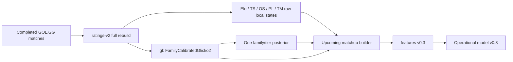

# EXP-076 — Unified regional ratings (`ratings-v2`)

## Decision

`ratings-v2` is the successor rating contract for a future operational model.
It has exactly six systems:

```text
elo, gl, ts, os, pl, tm
```

`gl` is the one active Glicko name inside this contract and means
`FamilyCalibratedGlicko2`. It is not the former `glicko2` package-backed
implementation and there is no active `gl2f` duplicate.

The contract is implemented but **not promoted to the default scheduler or the
frozen thesis model**. `latest-full` remains the immutable input contract for
`exp-039`. Changing what `latest-full/gl` means would make the frozen model
non-reproducible.

## Problem addressed

A local rating system learns strength from domestic games. Cross-league games
are sparse and connect regions with different competitive strength. Treating
all regions as one unadjusted coordinate system makes a strong local rating in
one ecosystem directly comparable with a strong local rating in another,
without evidence that the scales are aligned.

Maintaining a legacy Glicko and a regional Glicko next to each other in the
active application would create an ambiguous source of truth. The same applies
to giving Elo, TrueSkill, OpenSkill, Plackett-Luce, and Thurstone-Mosteller
five separate regional offset tables.

## Architecture



There are two layers:

1. **Raw skill systems.** Elo, TrueSkill, OpenSkill, Plackett-Luce, and
   Thurstone-Mosteller retain their own normal update mathematics and local
   skill state. `gl` uses the corrected Glicko-2 state: rating, RD, and
   volatility.
2. **One shared competition calibration.** The regional Glicko learns the
   family/tier location posterior and its uncertainty from eligible
   cross-family bridges. At matchup time it is projected onto the five raw
   systems as a common log-odds correction.

The regional posterior is not copied into five separate models. It is stored
once with the `gl` state and consumed through
`src/ratings/competition_calibration.py`.

## Rebuild contract

Run:

```bash
python -m betting_app.scripts.rebuild_regional_ratings \
  --ratings-version ratings-v2 \
  --source regional-ratings-v2
```

`rebuild_regional_ratings` performs a deterministic **full** rebuild. This is
intentional, not an omitted incremental mode:

- GOL.GG can correct results on a date already seen by a previous run;
- Glicko-2 consumes every complete calendar date against a frozen prior;
- a partial replay could make the regional Glicko and the five raw systems end
  at different effective cutoffs;
- a full rebuild produces one atomic replacement of `entity_ratings` for the
  version.

The historical flow is:

1. load complete, non-draw matches and first-game rosters;
2. classify each tournament with the date-aware competition taxonomy;
3. reject unknown classifications rather than inventing regional evidence;
4. process all matches of a calendar date against the same Glicko-2 prior;
5. update domestic affiliation only after that date is observed;
6. update Elo/TS/OS/PL/TM from the same chronological event sequence;
7. persist all six systems together under `ratings-v2`.

The raw systems never construct a legacy Glicko object in this rebuild.

## Regional Glicko-2

For player state \(r_i, RD_i, \sigma_i\), the regional engine uses the
corrected Glicko-2 implementation with simultaneous updates from a frozen
calendar-date prior. It includes actual inactivity inflation and does not use
an already-mutated opponent state while updating the other side.

Every player/team has a domestic affiliation where it is known:

```text
family: LCK, LEC, LPL, ERL, ...
tier:   major, academy, regional, ...
```

The effective Glicko coordinate is:

\[
r_{\mathrm{effective}} = r_{\mathrm{raw}} + L_{\mathrm{family}} + L_{\mathrm{tier}}
\]

Only eligible cross-family events contribute directional evidence for the
location posterior. Domestic events update skill but do not create artificial
regional bridge evidence.

For two sides \(A\) and \(B\), the location difference is:

\[
\Delta L = (L_{f_A} + L_{t_A}) - (L_{f_B} + L_{t_B})
\]

If both teams have the same family, the shared family and tier location is
cancelled exactly. This keeps domestic prediction invariant to a common
coordinate shift.

## Applying the same regional evidence to every system

For raw systems other than Glicko, the matchup builder first produces the
system's native probability \(p_s\). It applies the one shared posterior in
log-odds space:

\[
\tilde p_s = \sigma\left(
  \frac{\operatorname{logit}(p_s) + c\,\mathbb E[\Delta L]}
       {\sqrt{1 + \pi c^2\operatorname{Var}(\Delta L)/8}}
\right),
\qquad c = \frac{\ln 10}{400}
\]

The denominator is a logistic-normal approximation. Higher uncertainty in the
cross-region evidence therefore attenuates the correction instead of making it
more aggressive.

Rules:

- `gl` already contains its effective family/tier location and is **not**
  adjusted a second time;
- Elo, TS, OS, PL, and TM each receive the same one adjustment exactly once;
- same-family matchups have an exactly neutral adjustment;
- missing or untrusted affiliation is neutral for the shared projection. It is
  not evidence for either side and must not force the base probability to 50%.

## Persistence and audit trail

### `rating_runs`

`rating_runs.systems_json` contains:

```json
{
  "contract_version": "ratings-v2",
  "raw_systems": {
    "elo": {"regional_projection": "shared"},
    "ts": {"regional_projection": "shared"},
    "os": {"regional_projection": "shared"},
    "pl": {"regional_projection": "shared"},
    "tm": {"regional_projection": "shared"}
  },
  "gl": {
    "engine": "family-calibrated-glicko2-v1",
    "state": "full engine checkpoint",
    "metadata": "affiliations, rosters, activity"
  }
}
```

The actual payload contains the engine state, not the placeholder strings
shown above.

### `entity_ratings`

All rows use `ratings_version = "ratings-v2"`. `rating_system = "gl"` rows
contain an auditable `state_json` with:

```text
raw_rating, raw_rd, volatility
family, tier
family_residual, family_variance
tier_offset, tier_variance
offset, location_variance
competition_calibration = family-calibrated-glicko2-v1
```

No new per-player regional columns are required. A location is a posterior
owned by the rating run, not an independent player property.

## Feature and model versions

The explicit candidate path is:

```bash
python -m betting_app.scripts.build_upcoming_features \
  --feature-version player-team-ratings-w20-v0.3 \
  --ratings-version ratings-v2 \
  --w20-version w20-latest

python -m betting_app.scripts.predict_upcoming_matches \
  --feature-version player-team-ratings-w20-v0.3 \
  --ratings-version ratings-v2 \
  --model-version v0.3
```

`Operational-PlayerTeamRatings-W20/v0.3` is bound to the exact input contract:

```text
player-team-ratings-w20-v0.3 / ratings-v2
```

A different feature/rating pair with the same model version raises an error.
It cannot silently overwrite the artifact metadata.

This operational model is a transparent rating/W20 baseline, not a replacement
for the frozen thesis artifact. `exp-039` remains bound to its historical
features and `latest-full`.

## Promotion gate

Do not switch the scheduler merely because `ratings-v2` can build. Promotion
requires all of the following:

1. train a new immutable model artifact using `ratings-v2` and its new feature
   schema;
2. evaluate on a chronological holdout never used for model/feature selection;
3. report LogLoss, Brier, AUC, calibration, no-vig market benchmark,
   eligibility/exclusion counts, and temporal/block-bootstrap uncertainty;
4. verify feature/source time \(\leq\) cutoff \(\leq\) prediction time
   \(<\) quote time \(<\) match start for any executable market evaluation;
5. review a single scheduler cutover that changes ratings version, feature
   version, model version, and hybrid/EV consumers together.

Until then the scheduler continues to use the legacy operational contract.
There is no automated betting action in either path.

## Verification

The implementation added contract tests for:

- one `gl` plus exactly five raw systems in a unified snapshot;
- persisted regional provenance and posterior variance;
- exact domestic cancellation and cross-family projection;
- neutral legacy/missing affiliation behavior;
- immutable operational model input contracts.

Backend verification on the implementation commit:

```text
256 passed, 12 warnings
python -m pip check: No broken requirements found
```

The successful test suite proves code-path contracts. It does not promote the
candidate, prove market profitability, or validate a production deployment.
